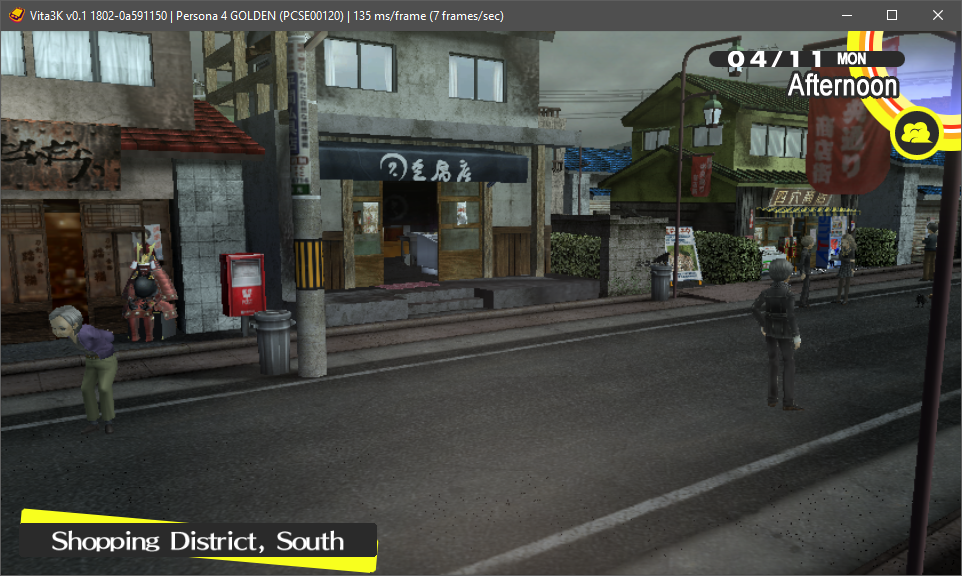

# Vita3K

## Introduction

Vita3K is an experimental PlayStation Vita emulator for Windows, Linux and macOS.

* [Website](https://vita3k.org/) (information for users)
* [Wiki](https://github.com/Vita3K/Vita3K/wiki) (information for developers)
* [**Discord**](https://discord.gg/MaWhJVH) (recommended)
* IRC `#vita3k` on **freenode** ([Web-based IRC client](https://webchat.freenode.net/?channels=%23vita3k))
* [Patreon](https://www.patreon.com/Vita3K)

## Compatibility

The emulator currently runs some homebrew programs. It is also able to load some decrypted commercial games.

- [Homebrew compatibility database](https://github.com/Vita3K/homebrew-compatibility/issues)
- [Commercial compatibility database](https://github.com/Vita3K/compatibility/issues)

|               **Persona 4 Golden** by Atlus                |                     **A Rose in the Twilight** by Nippon Ichi Software                      |
| :--------------------------------------------------------: | :-----------------------------------------------------------------------------------------: |
|  |  |

|                  **Alone with You** by Benjamin Rivers                  |                 **VA-11 HALL-A** by Sukeban Games                 |
| :---------------------------------------------------------------------: | :---------------------------------------------------------------: |
|  |  |

|              **Fruit Ninja** by Halfbrick Studios               |                **Jetpack Joyride** by Halfbrick Studios                 |
| :-------------------------------------------------------------: | :---------------------------------------------------------------------: |
|  |  |

## Licence

Vita3K is licensed under the **GPLv2** license. This is largely dictated by external dependencies, most notably Unicorn.

## Downloads
* [Windows](https://github.com/Vita3K/Vita3K/actions?query=event%3Apush+is%3Asuccess+branch%3Amaster)
  * [Visual C++ Redistributables](https://aka.ms/vs/16/release/vc_redist.x64.exe) (Install if not working.) 
* [Linux](https://github.com/Vita3K/Vita3K/actions?query=event%3Apush+is%3Asuccess+branch%3Amaster)
* [macOS](https://github.com/Vita3K/Vita3K/actions?query=event%3Apush+is%3Asuccess+branch%3Amaster)

## Building

See [`building.md`](./building.md).

## Running
Specify the path to a .vpk file as the first command line argument, or run `Vita3K --help` from the command-line for a full list of options.
For more detailed instructions on running/installing games on all platforms, please read the **#info-faq** channel on our [Discord Server](https://discord.gg/MaWhJVH).

## Bugs and issues
The project is at an early stage, so please be sensitive to that when opening new issues. Expect crashes, glitches, low compatibility and poor performance.

## Thanks
Thanks go out to people who offered advice or otherwise made this project possible, such as Davee, korruptor, Rinnegatamante, ScHlAuChi, Simon Kilroy, TheFlow, xerpi, xyz, Yifan Lu and many others.

## Donations
If you would like to show your appreciation or even help fund development, the project has a [Patreon](https://www.patreon.com/Vita3K) page.

## Supporters
Thank you to the following supporters:
* Mored1984

If you support us on Patreon and would like your name added, please get in touch or open a Pull Request.

## Note
The purpose of the emulator is not to enable illegal activity.

PlayStation and PS Vita are trademarks of Sony Interactive Entertainment Inc. The emulator is not related to or endorsed by Sony, or derived from confidential materials belonging to Sony.
