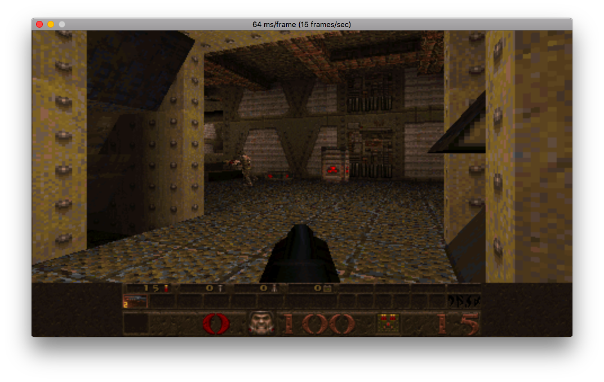
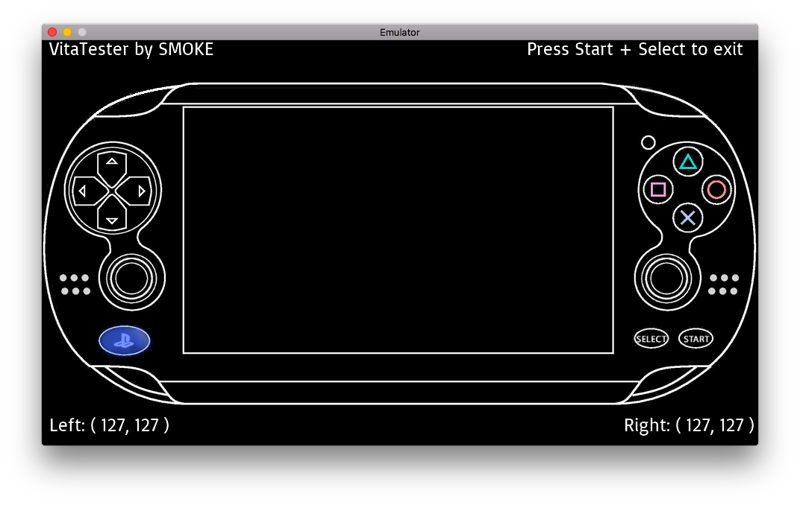

# Vita3K

## Introduction
Vita3K is an experimental PlayStation Vita emulator for Windows and macOS.

* [Website](https://Vita3K.github.io/)
* [Discord](https://discord.gg/6aGwQzh)
* IRC `#vita3k` on **freenode** ([Web-based IRC client](https://webchat.freenode.net/?channels=%23vita3k))
* [Patreon](https://www.patreon.com/Vita3K)

## Compatibility
The emulator currently runs a few homebrew programs in .vpk format. No commercial games are playable.

[vitaQuake](https://github.com/Rinnegatamante/vitaQuake) by **Rinnegatamante**

[VitaTester](https://github.com/SMOKE5/VitaTester) by **SMOKE5**

## Licence
Vita3K is licensed under the **GPLv2** license. This is largely dictated by external dependencies, most notably Unicorn.

## Building
### Prerequisites
[CMake](https://cmake.org/) is used to generate Visual Studio and Xcode project files. It is assumed that you have CMake installed and on your path. Other dependencies are provided as Git submodules or as prebuilt binaries.

### Windows (Visual Studio)
1. Run `gen.bat` to create a `build-windows` directory and generate a Visual Studio solution in there.
2. Open the `Vita3K.sln` solution.
3. Set the startup project to `emulator`.
4. Build.

### macOS (Xcode)
1. Run `gen.sh` to create a `build-macos` directory and generate an Xcode project in there.
2. Open the `Vita3K.xcodeproj` project.
3. When prompted to create schemes, create one for the `emulator` target only. The project builds many targets, so it will make your life easier if you create schemes as needed.
4. Build.

## Running
The emulator does not yet have a front end. Please specify the path to a .vpk file as the first command line argument.

## Bugs and issues
The project is at an early stage, so please be sensitive to that when opening new issues. Expect crashes, glitches, low compatibility and poor performance.

## Thanks
Thanks go out to people who offered advice or otherwise made this project possible, such as Davee, korruptor, Rinnegatamante, ScHlAuChi, Simon Kilroy, TheFlow, xerpi, xyz, Yifan Lu and many others.

## Donations
If you would like to show your appreciation or even help fund development, the project has a [Patreon](https://www.patreon.com/Vita3K) page.

## Note
The purpose of the emulator is not to enable illegal activity. 

PlayStation and PS Vita are trademarks of Sony Interactive Entertainment Inc. The emulator is not related to or endorsed by Sony, or derived from confidential materials belonging to Sony.
