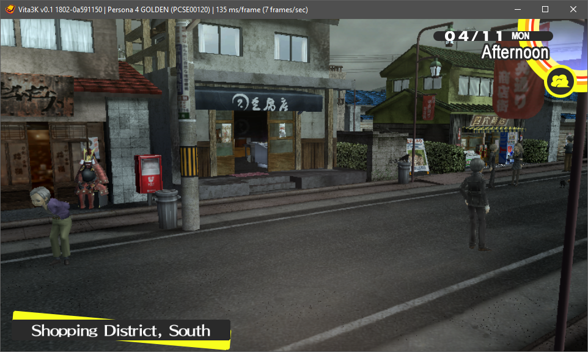

# Vita3K

## Introduction

Vita3K is an experimental PlayStation Vita emulator for Windows, Linux, macOS and Android.

* [Website](https://vita3k.org/) (information for users)
* [Wiki](https://github.com/Vita3K/Vita3K/wiki) (information for developers)
* [Discord server](https://discord.gg/MaWhJVH) (recommended)

## Compatibility

The emulator currently runs most homebrew programs. It is also able to load some commercial games.

- [Homebrew compatibility page](https://vita3k.org/compatibility-homebrew.html)
- [Commercial compatibility page](https://vita3k.org/compatibility.html)

## Gallery

|               **Persona 4 Golden** by Atlus                   |                     **A Rose in the Twilight** by Nippon Ichi Software                         |
| :-----------------------------------------------------------: | :--------------------------------------------------------------------------------------------: |
|  |  |

|                  **Alone with You** by Benjamin Rivers                     |                 **VA-11 HALL-A** by Sukeban Games                    |
| :------------------------------------------------------------------------: | :------------------------------------------------------------------: |
|  |  |

|              **Fruit Ninja** by Halfbrick Studios                  |                **Jetpack Joyride** by Halfbrick Studios                    |
| :----------------------------------------------------------------: | :------------------------------------------------------------------------: |
|  |  |

## License

Vita3K is licensed under the **GPLv2** license. This is largely dictated by external dependencies, most notably Unicorn.

## Downloads
* Windows
  * [Scoop](https://scoop.sh/#/apps?q=vita3k&s=0&d=1&o=true)
  * Requirements:
    * [Microsoft Visual C++ 2015-2022 Redistributable](https://aka.ms/vs/17/release/vc_redist.x64.exe)
* Linux
  * Arch based:
    * [vita3k-bin](https://aur.archlinux.org/packages/vita3k-bin)<small>AUR</small>
    * [vita3k-git](https://aur.archlinux.org/packages/vita3k-git)<small>AUR</small>
  * Requirements:
    * xdg-desktop-portal
* [Android](https://github.com/Vita3K/Vita3K-Android/releases/)
    * [Adreno drivers](https://github.com/K11MCH1/AdrenoToolsDrivers/releases/)
* Others
  * [Download Artifact](https://github.com/Vita3K/Vita3K/actions?query=event%3Apush+is%3Asuccess+branch%3Amaster)

## Building

Please see [`building.md`](./building.md).

## Running
Look through the app list and click on the app you would like to run and click the start button.

For more detailed instructions on running/installing apps on Vita3K, please read the **#info-faq** channel on our [Discord Server](https://discord.gg/MaWhJVH).

## Bugs and issues
The project is in an early stage, so please be mindful when opening new issues. Expect crashes, glitches, low compatibility and poor performance.

## Thanks
Thanks go out to the developer team and [everyone who has contributed](https://github.com/Vita3K/Vita3K/graphs/contributors). These are people like petmac, frangarcj, VelocityRa, 1whatleytay, EXtremeExploit, HolyMcDiver, HorrorTroll, IllusionMan1212, KorewaWatchful, scribam, sunho, wfscans, Macdu, bookmist and pent0.

## Note
The purpose of this emulator is not to enable illegal activity. You can dump games from a Vita by using [NoNpDrm](https://github.com/TheOfficialFloW/NoNpDrm) or [FAGDec](https://github.com/CelesteBlue-dev/PSVita-RE-tools/tree/master/FAGDec/build). You can get homebrew programs from [VitaDB](https://vitadb.rinnegatamante.it/).

PlayStation, PlayStation Vita and PlayStation Network are all registered trademarks of Sony Interactive Entertainment Inc. This emulator is not related to or endorsed by Sony, or derived from confidential materials belonging to Sony.
