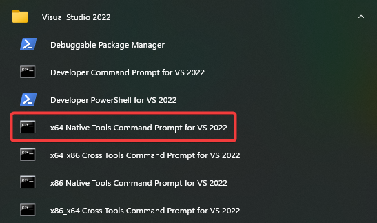

# Build Vita3K

Vita3K uses CMake for its project configuration and generation and should in theory be compatible with any project generator supported by CMake, C++17 compatible compiler and IDE with CMake support. However, the following settings are recommended to be used when compiling or developing:

Target OS | Host OS | [Project generator](https://cmake.org/cmake/help/latest/manual/cmake-generators.7.html) (`-G`) | C/C++ Compiler (`-DCMAKE_C_COMPILER` and `-DCMAKE_CXX_COMPILER`)
--- | --- | --- | ---
Windows | Windows | Visual Studio / MSBuild | `cl` a.k.a Microsoft Visual C/C++ Compiler (included as a part of the [Build Tools for Visual Studio 2019](https://visualstudio.microsoft.com/downloads/#build-tools-for-visual-studio-2019) and the ` Dekstop development with C++` Visual Studio workload)
macOS | macOS | Xcode | Clang (`clang` and `clang++`)
Linux | Linux | Ninja | Clang (`clang` and `clang++`)

Vita3K also comes bundled with CMake toolchain files found in `./cmake/toolchain` for each target platform that automatically set up platform-specific variables such as the C/C++ compiler to the values shown in table above and must always be used when generating projects using CMake. Despite this, if needed the set values can be overwritten at project generation as well via CMake `-D` arguments and the project generator will be either the default one for the host OS platform or the one the person building the emulator decides to use.

**Note: Vita3K doesn't support compilation for 32-bit/x86/i386 platforms.**

For convenience, the following building instructions are given as examples based on the information from the table:

## Windows

### Visual Studio 2019
- Install Visual Studio 2019 and choose to install `Desktop development with C++`. You will get compiler and `cmake` required for building.

  Example for Visual Studio 2019:

  

- Install `git` to `clone` the project. Download and install `git` from [here](https://git-scm.com).

- Clone this repo.

  ```cmd
  git clone --recursive https://github.com/Vita3K/Vita3K
  cd Vita3K
  ```

- Run Visual Studio 2019. On the project selection window open the local clone of the repository as a folder. Thanks to the integration between Visual Studio and CMake, Visual Studio will automatically setup the project for you.
- Use the [CMake Settings Editor](https://docs.microsoft.com/en-us/cpp/build/customize-cmake-settings?view=msvc-160) to set "CMake toolchain file" to `./cmake/toolchain/windows-x64.cmake`. If asked to do so, delete and re-generate the CMake cache.

From there, the project will be ready to build right from the Visual Studio UI.


### Build using terminal
-  Install:
   -  [Git](https://git-scm.com)
   -  [CMake](https://cmake.org/download/)
   -  Either the [Build Tools for Visual Studio 2019](https://visualstudio.microsoft.com/downloads/#build-tools-for-visual-studio-2019) or Visual Studio 2019 with the ` Dekstop development with C++` workload.
- On the Start Menu, open the `x64 Native Tools Command Prompt for Visual Studio 2019`.
  <p align="center">
    
  </p>

- Clone the repository:
  ```cmd
  git clone --recursive https://github.com/Vita3K/Vita3K
  cd Vita3K
  ```

- Generate the project:
  ```cmd
  cmake -S . -B build-windows -G "Visual Studio 2019 16" -DCMAKE_TOOLCHAIN_FILE=./cmake/toolchain/windows-x64.cmake
  ```
  The line above will generate a Visual Studio 2019 project inside a folder called `build-windows`.

- Build the project:
  ```cmd
  cmake --build build-windows
  ```

## macOS (Xcode)

- Install Xcode at App Store.

- Install [`brew`](https://brew.sh).

- Install dependencies with `brew`.

  ```sh
  brew install git cmake
  ```

- Clone this repo.

  ```sh
  git clone --recursive https://github.com/Vita3K/Vita3K
  cd Vita3K
  ```

- Generate Xcode project.

  ```
  cmake -S . -B build-macos -G Xcode -DCMAKE_TOOLCHAIN_FILE=./cmake/toolchain/macos-x64.cmake
  ```
  This example will generate a Xcode project inside a folder called `build-macos`.

- Open Xcode project `vita3k.xcodeproj` generated in `build-macos` directory.

- When prompted to create schemes, create one for the `vita3k` target only. The project builds many targets, so it will make your life easier if you create schemes as needed.

- Build the project using the Xcode UI. If needed, the build process can be invoked as well the same way as with the other platforms using a terminal:
  ```sh
  cmake --build build-macos
  ```

## Linux

### Ubuntu/Debian

- Install dependencies.

  ```sh
  sudo apt install git cmake ninja-build libsdl2-dev pkg-config libgtk-3-dev clang
  ```

- Clone this repo.

  ```sh
  git clone --recursive https://github.com/Vita3K/Vita3K
  cd Vita3K
  ```

- Generate the project.

  ```sh
  cmake -S . -B build-linux -G Ninja -DCMAKE_TOOLCHAIN_FILE=./cmake/toolchain/linux-x64.cmake
  ```
  This example will generate a Ninja (`ninja-build`) project instead of a Make (`make`, the default project generator for Linux) one inside a folder called `build-linux`.

- Build the project:
  ```sh
  cmake --build build-linux
  ```

## Note

- After cloning or checking out a branch, you should always update submodules.
  ```sh
  `git submodule update --init --recursive`
  ```

- If `boost` failed to build, you can opt out for system `boost` package (Linux and macOS only).

  ```sh
  brew install boost # for macOS
  sudo apt install libboost-all-dev # for Ubuntu/Debian
  ```
